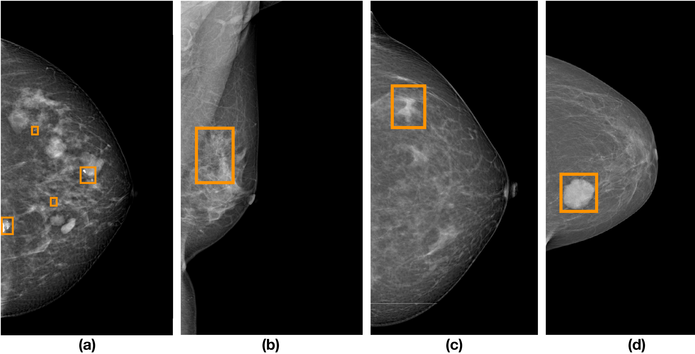

# AsyDisNet: Scalable Mammographic Asymmetry and Architectural Distortion Detection with Angle-based Quadruplet Loss
Zhenjie Cao, Zhuo Deng, Zhicheng Yang, Jialin Yuan, Jie Ma, **Lan Ma**

# News

* **2024.10.15** Sample mammograms for each lesion have been released. :rainbow:

---

Examples of different lesion types on mammograms: (a) calcification, (b) architectural distortion (AD), (c) asymmetry (AS), (d) mass.

Sample mammograms for each lesion have uploaded in [samples](https://github.com/ML-AILab/AsyDisNet/tree/main/samples).

The full dataset will be released upon approval!!
